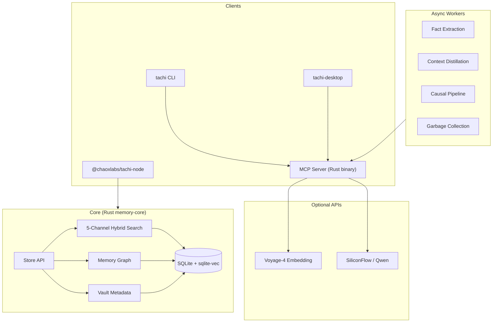

<div align="center">
  
  <h1>✧ Tachi</h1>
  <p><strong>Local-First Memory and Workflow Control Plane for Autonomous AI Agents</strong></p>
  <p>
    <a href="README.md"><b>English</b></a> ·
    <a href="README.zh-CN.md">简体中文</a> ·
    <a href="README.classical.md">文言文</a>
  </p>
  <p>
    <a href="https://www.gnu.org/licenses/agpl-3.0"></a>
    
    
    
    
  </p>
</div>

---

## TL;DR

Tachi is a single-binary, local-first memory and coordination backend for AI agents. It runs as an [MCP](https://modelcontextprotocol.io/) server (`memory-server`) and gives agents:

- **Persistent memory** with hybrid semantic + lexical + graph retrieval
- **Hierarchical namespaces** (`/user/preferences`, `/project/architecture`)
- **Causal graph edges** between memories, entities, and decisions
- **Domain-scoped storage** with per-domain GC and retention policies
- **Encrypted local vault** for API keys and secrets
- **Agent coordination** via handoff, kanban, and pub/sub (Ghost Whispers)
- **Skill packs and capability hub** — register once, use from any agent
- **Workflow control plane** — `tachi_dispatch`, `tachi_arena`, `tachi_verify`, `tachi_agent_eval`

All state lives in embedded SQLite. **Zero external database dependencies.**

Named after the Tachikoma from *Ghost in the Shell*: agents that evolve through shared memory.

---

## Why Tachi

Agent memory today usually looks like this: every session starts cold, important context is stuffed into a flat vector store, and after a few weeks the prompt is bloated with irrelevant chunks while the *why* behind key decisions has vanished.

Tachi is built around four convictions:

1. **Memory should be structured, not dumped.** Hierarchical `path` namespaces, causal graph edges, and domain scoping keep long-term context organized and traversable.
2. **Retrieval should be hybrid and fast.** Semantic (sqlite-vec + Voyage), lexical (FTS5 + CJK), temporal decay (ACT-R), and graph spreading activation are fused via RRF. We optimize for local, low-latency lookups; reproducible benchmarks are on the roadmap.
3. **Agents should share infrastructure, not spawn chaos.** Tachi Hub registers MCP servers and skills once; connected agents share connection pooling, idle cleanup, circuit breakers, and sanitized environments. No zombie processes.
4. **Long-term state belongs locally.** All databases are SQLite files. No cloud DB required. Cloud sync should move encrypted bundles and event logs, not live WAL files.

## How Tachi Compares

Tachi is not a general-purpose vector database or a managed memory cloud. It is a local-first coordination backend for agents that speak MCP.

| Dimension | Tachi | Mem0 | Letta | Chroma | Raw vector DB |
|---|---|---|---|---|---|
| **Integration protocol** | MCP server (STDIO / Streamable HTTP) | Language SDKs | Python SDK + ADE | HTTP API + SDKs | None |
| **Deployment** | Single Rust binary | Library + optional service | Service + frontend | Service + optional Cloud | Depends |
| **Storage backend** | Local SQLite + sqlite-vec | Usually PG / Redis / vector DB | PG + Qdrant / Chroma | Chroma index | Various |
| **External dependencies** | Zero (embedding provider optional) | Medium | Medium | Low to medium | High |
| **Default data locality** | Local-first | Cloud-first, self-hostable | Self-hosted | Self-hosted / Cloud | Depends |
| **Memory organization** | `path` hierarchy + causal graph + domain | Entity + session | Agent state + memory blocks | Collection + metadata | None |
| **Workflow control** | `dispatch` / `arena` / `verify` / `eval` | None | Agent orchestration | None | None |
| **Target user** | Individuals / small teams running autonomous agents | App developers adding memory | Builders of stateful agents | Systems needing vector search | Infrastructure engineers |

---

## Quick Start

### 1. Install

```bash
brew tap kckylechen1/tachi && brew install tachi
```

Or use the shell installer (also installs the OpenClaw plugin when detected):

```bash
bash -c "$(curl -fsSL https://raw.githubusercontent.com/kckylechen1/tachi/v1.5.3/scripts/install.sh)"
```

Verify:

```bash
tachi --version
```

### 2. Configure your agent

Add Tachi to your agent's MCP config. The profile controls how many tools the agent sees:

```json
{
  "mcpServers": {
    "tachi": {
      "command": "tachi",
      "env": {
        "VOYAGE_API_KEY": "<your-key>",
        "SILICONFLOW_API_KEY": "<your-key>",
        "TACHI_PROFILE": "standard"
      }
    }
  }
}
```

- `VOYAGE_API_KEY` — required for embeddings.
- `SILICONFLOW_API_KEY` — recommended for extraction, summaries, and foundry distillation.
- `TACHI_PROFILE` — see [Tool Surface Profiles](#tool-surface-profiles) below.

The server also loads `.env` from the project root automatically. Copy `.env.example` to `.env` for per-project configuration.

### 3. Use

These examples show the JSON arguments you would pass to the MCP tools. Facade tools expose the same fields as their underlying native tools; the full schemas live in `crates/memory-server/src/tool_params/facade.rs`.

```json
// tachi_save — structured memory
{
  "tool": "tachi_save",
  "arguments": {
    "text": "Frontend must use Vite, never Webpack. Tailwind is allowed.",
    "path": "/project/frontend",
    "importance": 0.8,
    "keywords": ["vite", "webpack", "tailwind"],
    "retention_policy": "durable"
  }
}

// tachi_search — hybrid recall
{
  "tool": "tachi_search",
  "arguments": {
    "query": "What is the frontend build policy?",
    "path_prefix": "/project",
    "top_k": 6,
    "scope": "memory"
  }
}

// set_state — deterministic KV (no embeddings)
{
  "tool": "set_state",
  "arguments": {
    "namespace": "trading",
    "key": "watchlist",
    "value": ["600089", "688256"]
  }
}
```

Host-specific config paths and advanced setup are in [`docs/INSTALL.md`](docs/INSTALL.md).

---

## Architecture


```mermaid
graph TD
    subgraph Clients["Clients"]
        CLI["tachi CLI"]
        RMCP["MCP Server (Rust binary)"]
        Desktop["tachi-desktop"]
        Node["@chaoxlabs/tachi-node"]
    end

    subgraph Cloud["Optional APIs"]
        VOYAGE["Voyage-4 Embedding"]
        SILICON["SiliconFlow / Qwen"]
    end

    subgraph Workers["Async Workers"]
        EXTRACT["Fact Extraction"]
        DISTILL["Context Distillation"]
        CAUSAL["Causal Pipeline"]
        GC["Garbage Collection"]
    end

    subgraph Core["Core (Rust memory-core)"]
        API["Store API"]
        SEARCH["5-Channel Hybrid Search"]
        GRAPH["Memory Graph"]
        VAULT["Vault Metadata"]
        API --> SEARCH
        API --> GRAPH
        API --> VAULT
        SEARCH --> DB
        GRAPH --> DB
        VAULT --> DB
    end

    DB[(SQLite + sqlite-vec)]

    RMCP --> VOYAGE
    RMCP --> SILICON
    CLI --> RMCP
    Desktop --> RMCP
    Node --> Core
    Workers --> RMCP
```

---

## Project Structure

| Path | What it is |
|------|------------|
| `crates/memory-core` | Rust core: SQLite storage, migrations, hybrid search, graph, domains, vault metadata, sqlite-vec. |
| `crates/memory-server` | MCP/CLI binary, profile filtering, Hub routing, dispatch/workflow tools, wiki, vault encryption, daemon locking, Foundry background workers. |
| `crates/memory-node` | Node.js bindings (`@chaoxlabs/tachi-node`) for native integration. |
| `packages/tachi-cli` | TypeScript CLI and npm wrapper. |
| `apps/tachi-desktop` | Vite/React desktop UI. |
| `tools/cleaner` | `tachi-clean` utility for safe target/worktree/temp cleanup. |
| `skill/` | Built-in skill packs: `amp`, `codex`, `superpowers`, `waza`. |
| `integrations/openclaw` | OpenClaw plugin. |
| `docs/` | Agent ecosystem specs, install guide, and engineering docs. |
| `bin/` | Locally built release binaries. |

---

## Core Capabilities

### 1. Hierarchical Memory
Memories are stored under `path` namespaces (e.g. `/user/preferences`, `/project/architecture`, `/handoff/active`) instead of a flat index. This keeps project, user, and coordination contexts isolated and composable.

### 2. 5-Channel Hybrid Search
- **Semantic** — `sqlite-vec` KNN with Voyage-4 embeddings.
- **Lexical** — CJK-optimized FTS5 via `libsimple`, with query expansion (synonyms, acronyms, phrase variants) for sparse corpora.
- **Temporal decay** — ACT-R inspired forgetting curve.
- **Graph spreading activation** — activation propagates along causal/entity edges from seed weights; noisy-OR within each hop prevents dense clusters from dominating.
- **RRF fusion** — reciprocal rank fusion blends all channels, with vector cosine weighted in to reduce rank inversions on highly semantic queries.

### 3. Causal Graph
`add_edge` / `get_edges` create and traverse causal, temporal, and entity relationships. `save_memory` can automatically link entries sharing entities (`auto_link`).

### 4. Domain-Aware Routing
`register_domain` creates isolated scopes with per-domain GC thresholds (`gc_threshold_days`), default retention policies, and path prefixes. `save_memory` and `search_memory` can filter by domain.

### 5. Encrypted Vault
Local-first secret storage: Argon2id KDF + AES-256-GCM, per-secret nonces, auto-lock after inactivity, brute-force protection, per-secret agent ACLs, and multi-key rotation. Project-local agents can resolve Vault secrets via `.tachi/vault.env` aliases. See [`docs/INSTALL.md`](docs/INSTALL.md).

### 6. Tachi Hub & Skill Packs
Register MCP servers, skills, and toolchains once; any connected agent can discover and call them. `pack_register` / `pack_project` install curated skill collections and project them to Claude, Cursor, Codex, Gemini, and OpenCode formats. `run_skill` executes a skill as a native MCP tool.

### 7. Agent Coordination
- **Ghost Whispers** — persistent topic-based pub/sub between agents (`ghost_publish`, `ghost_subscribe`, `ghost_ack`, `ghost_reflect`, `ghost_promote`).
- **Kanban** — cross-agent cards with `ack` / `progress` / `result` states (`post_card`, `check_inbox`, `update_card`).
- **Handoff tokens** — structured context transfer between agent sessions (`handoff_leave`, `handoff_check`).

### 8. Workflow Control Plane
Tachi is not only a memory store; it is becoming the durable control plane for agent engineering:

- **`tachi_dispatch`** — spawn bounded worker agents with a permission profile and required evidence.
- **`tachi_arena`** — tracked worker/advisor mission ledger with auditable run state.
- **`tachi_verify`** — record background verification evidence (tests, type checks, safe-merge gates) under `.tachi/runs/<flow_id>/verification.json`.
- **`tachi_agent_eval`** — live performance matrix and scorecards that feed future routing decisions.
- **`tachi_complete`** — record task outcomes with `subagents`, `tests_run`, `evidence_refs`, latency, token, and cost fields.

### 9. Neural Foundry & Wiki
- **Foundry** — server-owned context lifecycle: `recall_context`, `capture_session`, `compact_context`, `section_build`, `compact_rollup`, `compact_session_memory`, plus agent evolution proposals.
- **Wiki** — durable knowledge pages maintained by agents: `tachi_wiki_write`, `tachi_wiki_search`, `wiki_browse`, `wiki_lint`.

---

## Tool Surface Profiles

Tachi exposes a filtered MCP surface based on `TACHI_PROFILE`. The full `admin` catalog is large; most agents should use a smaller profile.

| Profile | What is exposed | Best for |
|---------|-----------------|----------|
| `standard` | Curated 12-tool facade surface: `tachi_search`, `tachi_save`, `tachi_memory`, `tachi_task`, `tachi_arena`, `tachi_verify`, `tachi_agent_eval`, `tachi_web_search`, `tachi_wiki`, `tachi_skill`, `tachi_gh`, `vault_status`, plus `runtime_info` and `tachi_tools`. | IDE agents: Claude, Cursor, Codex, Windsurf, Trae, Antigravity. |
| `coordinate` | `remember` + `coordinate` bundles: adds `handoff_*`, `post_card`, `check_inbox`, `update_card`, `tachi_dispatch`, `approve_merge`, `tachi_handoff`, `tachi_workflow`, `tachi_orchestrator`. | Leader/orchestrator agents that dispatch work and coordinate across agents. |
| `operate` | `remember` + `operate` bundles: adds Foundry lifecycle, `agent_register`, `hub_call`, `vault_unlock`/`lock`/`status`, `wiki_lint`. | Runtime adapters, OpenClaw, ops automation. |
| `delegate` | Curated 7-tool surface: `tachi_tools`, `runtime_info`, `tachi_memory`, `tachi_web_search`, `tachi_browse`, `tachi_unstick`, `tachi_complete`, `run_skill`. | Worker subagents spawned by `tachi_dispatch`. No dispatch, no handoff. |
| `admin` | Full catalog. | Maintenance, development, and governance. |

Host aliases are resolved automatically: `claude`, `claude-code`, `codex`, `cursor`, `trae`, `windsurf`, `ide`, `antigravity` → `standard`; `worker`, `subagent`, `delegate` → `delegate`; `openclaw`, `hermes`, `runtime`, `adapter`, `ops` → `operate`.

If no profile is set, Tachi defaults to `standard` (since v1.0.1).

---

## Model Stack

Phase 2 simplified the lane model. Background skill and foundry calls now go through the **Claude CLI pool first**, falling back to the raw API lane on error. For most deployments you only need:

| Purpose | Required | Default |
|---------|----------|---------|
| Embeddings | **Yes** | Voyage-4 via `VOYAGE_API_KEY` |
| Extraction / summary / distillation | Recommended | SiliconFlow `Qwen/Qwen3.5-27B` via `SILICONFLOW_API_KEY` |

Optional per-lane overrides (`EXTRACT_*`, `DISTILL_*`, `SUMMARY_*`, `REASONING_*`) remain supported for advanced setups. See `.env.example` for details.

---

## Environment Configuration

Copy `.env.example` to `.env` in your project root:

```bash
# Required
VOYAGE_API_KEY=your_voyage_key_here

# Recommended
SILICONFLOW_API_KEY=your_siliconflow_key_here
SILICONFLOW_BASE_URL=https://api.siliconflow.cn/v1/chat/completions
SILICONFLOW_MODEL=Qwen/Qwen3.5-27B

# Optional: override global DB path. Defaults to ~/.tachi/global/memory.db;
# project DBs are auto-detected at <git-root>/.tachi/memory.db.
MEMORY_DB_PATH=~/.tachi/global/memory.db
```

The server loads `.env` from the project root automatically.

---

## Database Safety

Tachi uses SQLite in WAL mode. Violating these rules can corrupt the database:

| Rule | Why |
|------|-----|
| **Single instance per DB** | The server holds an exclusive file lock (`memory.db.lock`). Only one Tachi process should write to a given database file. |
| **No cloud-synced paths** | iCloud, Dropbox, OneDrive, and Google Drive are incompatible with SQLite WAL. Keep databases in `~/.tachi/` or local project paths. |
| **No concurrent raw writes** | Do not run `sqlite3` INSERT/UPDATE on the DB while the server is running. Read-only queries are safe. |
| **Graceful shutdown** | The server handles SIGINT/SIGTERM and runs `PRAGMA optimize` on exit. Avoid `kill -9`. |

Live SQLite files should stay local. Sync encrypted bundles, append-only event logs, vault ciphertext, workflow summaries, and wiki/skill artifacts instead.

---

## Local Development

```bash
# Build release binary
cargo build --release

# Run all tests
cargo test --all

# Run the MCP server from source with the standard profile
cargo run -p memory-server -- --profile standard
```

Requires Rust ≥ 1.75. `maturin` and `cargo-watch` are useful for Node binding work and iterative development.

---

## Benchmarks

Reproducible benchmarks are being formalized. Current design targets include:

- **Local-first latency**: optimize for sub-10 ms lookups on warm SQLite.
- **Hybrid retrieval**: combine semantic, lexical, temporal, and graph signals.
- **Tiered context**: reduce prompt bloat via `L0 → L1 → L2` compaction.
- **Zero external DB dependencies**: single Rust binary, one SQLite file per store.

---

## Acknowledgements

Tachi's design is informed by prior work in agent long-term memory:

- **[LongMem](https://github.com/Victorwz/LongMem)** (NeurIPS 2023) — decoupled memory architecture; influenced dual-DB isolation and cached long-context design.
- **[gbrain](https://github.com/garrytan/gbrain)** — brain-vs-memory layering; influenced namespace design, global/project isolation, and background GC pipelines.
- **[ENGRAM](https://arxiv.org/abs/2511.12960)** — typed memory categories + dense retrieval; validated the hybrid search direction.
- **[Karpathy's LLM Wiki](https://gist.github.com/karpathy/442a6bf555914893e9891c11519de94f)** — LLM-maintained structured wiki pages; directly inspired the Tachi Wiki system.

---

## License

[AGPLv3](LICENSE) © 2026 Tachi Authors.
