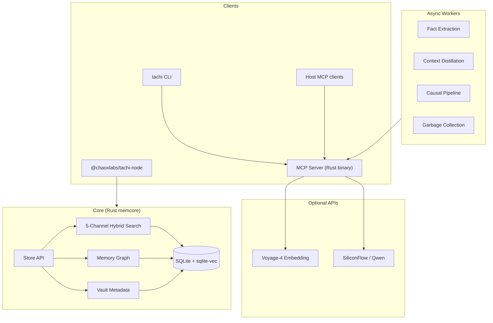

<div align="center">
  
  <h1>✧ Tachi</h1>
  <p><strong>Local-First Memory and Workflow Control Plane for Autonomous AI Agents</strong></p>
  <p>
    <a href="README.md"><b>English</b></a> ·
    <a href="README.zh-CN.md">简体中文</a> ·
    <a href="README.classical.md">文言文</a>
  </p>
  <p>
    <a href="https://www.gnu.org/licenses/agpl-3.0"></a>
    
    
    
    
  </p>
</div>

---

## TL;DR

Tachi is a single-binary, local-first memory and coordination backend for AI agents. It runs as an [MCP](https://modelcontextprotocol.io/) server (`tachi-server`) and gives agents:

- **Persistent memory** with hybrid semantic + lexical + graph retrieval
- **Hierarchical namespaces** (`/user/preferences`, `/project/architecture`)
- **Causal graph edges** between memories, entities, and decisions
- **Domain-tagged storage** — free-text `domain` field on every memory, filterable via `tachi_memory(action="save")`/`tachi_memory(action="search")`
- **Encrypted local vault** for API keys and secrets
- **Agent coordination** via handoff, kanban, and pub/sub (Ghost Whispers)
- **Skill packs and capability hub** — register once, use from any agent
- **Six-facade product surface** — `tachi_memory`, `tachi_task`, `tachi_agent_eval`, `tachi_staff`, `tachi_gh`, `tachi_a2a`
- **Continuity memory** — typed events, pattern projections, outcome labels, and project-cycle context
- **Lifecycle closure** — GitHub issues/PRs, docs/specs, wiki, memory, verification, and release notes in one loop

All state lives in embedded SQLite. **Zero external database dependencies.**

Named after the Tachikoma from *Ghost in the Shell*: agents that evolve through shared memory.

### Current Release

Current release: `v2.0.0`.

This is a major release: public MCP routes were removed and the on-disk schema
advanced from 28 to 39, so scripts and prompts that call retired tools must
move to the surviving facades before upgrading. The highlights:

- The ordinary Lead surface is six facades: `tachi_memory`, `tachi_task`,
  `tachi_agent_eval`, `tachi_staff`, `tachi_gh`, and `tachi_a2a`. Worker
  (`delegate`) sessions see exactly `tachi_memory`, `tachi_task`, `tachi_staff`, `tachi_gh`, and `tachi_a2a` (no `tachi_agent_eval`).
- Retired model-facing routes are gone from the router, with different fates:
  memory save/search aliases and direct Kanban routes have their capabilities on
  the canonical facades (`tachi_memory`, `tachi_task` board actions);
  orchestrator and skill recommendation/evolution routes are removed without a
  model-facing replacement. The retired Memory administration actions split by
  action: retired `progress` moves to `tachi_task(action='status')`, `readiness` to
  `tachi_status` (a retained route under Ops/admin authorization only, not
  ordinary Lead/Worker discovery), and `delete`/`gc`/`doctor_scan` to the
  operator CLI (`tachi delete` and `tachi gc` plan|apply, `tachi doctor`);
  `ingest`/`ingest_source`/`pattern_feedback` have no model-facing replacement.
- `tachi_task(action='status')` now carries CurrentTruth work facts (board
  column, blockers, top action) for exactly the resolved refs. It is an
  orientation view, not a completion verdict: sources CurrentTruth does not
  own render typed `unavailable`.
- The store schema moved 28 -> 39 (CurrentTruth, delivery spine, A2A
  mailboxes, memory outbox, verified admissions). Follow the ordered upgrade
  procedure in [`docs/INSTALL.md` Step 1b](docs/INSTALL.md): stop the actual
  service manager and other writers, back up stores and the old binary,
  install the new binary without starting it, then run `tachi migrate
  --rename-legacy` (plan) and `--rename-legacy --apply --offline` (filename-only
  conversion) before ordinary `tachi migrate --apply` (schema upgrade). Keep
  all old/new readers and writers stopped throughout and verify each finding.
  Exit code 0 is not success:
  `skipped_locked`/`failed`/`not_attempted` findings need attention, and a
  re-run plan should show every store `up_to_date` at 39. Older binaries
  refuse to open a newer-stamped database, so restore from backup instead of
  rolling the binary back.
- Dispatch V2 commits the model plan to `<run_dir>/status.json#/model_plan`
  atomically with its serving-model receipt; `plan.md` stays a V1 placeholder.
  V1 single-stage dispatch is unchanged.
- The model broker owns the provider wire directly, with SSE stream grammars
  for OpenAI-compatible and Anthropic providers, provider key health, and
  `tachi broker` alias governance.
- Standalone store files use `tachi-memory.db`. Existing `memory.db` stores
  require explicit offline conversion as described above; ordinary opens
  refuse them. Conversion leaves a compatibility symlink for this release window.
- Bound-project memory searches can now return MCP ResourceLinks alongside
  the unchanged search text. A read returns exact text only while its source,
  revision, body digest and active time window match. Global/Wiki/private
  memories are excluded; role-constrained searches and configured or unreadable
  sandbox policy disable this feature. Resource catalogs remain empty.
- Cargo, npm, lockfiles, docs, installer URLs, and OpenClaw plugin metadata
  are checked by `scripts/check_release_versions.py` and CI before release.
  The tag pipeline ships the Mac arm64 CLI and the Homebrew formula; npm
  packages publish through their own manual workflow, so a fresh tag does not
  by itself mean the new version is on npm.

See [CHANGELOG.md](CHANGELOG.md) for the full release notes and the complete
upgrade path.

---

## Why Tachi

Agent memory today usually looks like this: every session starts cold, important context is stuffed into a flat vector store, and after a few weeks the prompt is bloated with irrelevant chunks while the *why* behind key decisions has vanished.

Tachi is built around four convictions:

1. **Memory should be structured, not dumped.** Hierarchical `path` namespaces, causal graph edges, and domain scoping keep long-term context organized and traversable.
2. **Retrieval should be hybrid and fast.** Semantic (sqlite-vec + Voyage), lexical (FTS5 + CJK), temporal decay (ACT-R), and graph spreading activation are fused via RRF. We optimize for local, low-latency lookups; reproducible benchmarks are on the roadmap.
3. **Agents should share infrastructure, not spawn chaos.** Tachi Hub registers MCP servers and skills once; connected agents share connection pooling, idle cleanup, circuit breakers, and sanitized environments. No zombie processes.
4. **Long-term state belongs locally.** All databases are SQLite files. No cloud DB required. Cloud sync should move encrypted bundles and event logs, not live WAL files.

## How Tachi Compares

Tachi is not a general-purpose vector database or a managed memory cloud. It is a local-first coordination backend for agents that speak MCP.

| Dimension | Tachi | Mem0 | Letta | Chroma | Raw vector DB |
|---|---|---|---|---|---|
| **Integration protocol** | MCP server (STDIO / Streamable HTTP) | Language SDKs | Python SDK + ADE | HTTP API + SDKs | None |
| **Deployment** | Single Rust binary | Library + optional service | Service + frontend | Service + optional Cloud | Depends |
| **Storage backend** | Local SQLite + sqlite-vec | Usually PG / Redis / vector DB | PG + Qdrant / Chroma | Chroma index | Various |
| **External dependencies** | Zero (embedding provider optional) | Medium | Medium | Low to medium | High |
| **Default data locality** | Local-first | Cloud-first, self-hostable | Self-hosted | Self-hosted / Cloud | Depends |
| **Memory organization** | `path` hierarchy + causal graph + domain | Entity + session | Agent state + memory blocks | Collection + metadata | None |
| **Workflow control** | `task` / `staff` / `verify` | None | Agent orchestration | None | None |
| **Target user** | Individuals / small teams running autonomous agents | App developers adding memory | Builders of stateful agents | Systems needing vector search | Infrastructure engineers |

---

## Quick Start

### 1. Install

```bash
brew tap kckylechen1/tachi && brew install tachi
```

Or use the shell installer. The v2.0.0 tag publishes no OpenClaw plugin
asset, so binary installs pass `--skip-plugin`:

```bash
bash -c "$(curl -fsSL https://raw.githubusercontent.com/kckylechen1/tachi/v2.0.0/scripts/install.sh)" -- --skip-plugin
```

On macOS the shell installer also installs/restarts a user LaunchAgent at
`~/Library/LaunchAgents/com.kckylechen.tachi.daemon.plist`. Skip that with
`--skip-daemon-service` if you only want the CLI/MCP stdio binary. The tag
pipeline ships exactly one prebuilt archive, `tachi-v2.0.0-aarch64-apple-darwin`
(Apple Silicon macOS); other platforms must build from source, unverified.

Verify:

```bash
tachi --version
tachi daemon status
```

Upgrading from 1.9.x: the store schema moves 28 -> 39 and older binaries refuse
a newer-stamped store, so follow the ordered procedure in
[`docs/INSTALL.md` Step 1b](docs/INSTALL.md) (stop the launchd supervisor, back
  up, offline filename conversion then `tachi migrate` plan/apply with the new
  binary, verify each finding, then
restart). OpenClaw users: the plugin has no published 2.0.0 asset yet; keep the
existing plugin install working against the 2.0.0 binary and see
[`integrations/openclaw`](integrations/openclaw) before reinstalling. The plugin
is a thin MCP facade: it starts or connects to the Tachi runtime over stdio,
exposes OpenClaw-facing memory tools, and does not maintain its own shadow store
or SQLite index.

### 2. Configure your agent

Add Tachi to your agent's MCP config. The profile controls how many tools the agent sees:

```json
{
  "mcpServers": {
    "tachi": {
      "command": "tachi",
      "env": {
        "VOYAGE_API_KEY": "<your-key>",
        "SILICONFLOW_API_KEY": "<your-key>",
        "TACHI_PROFILE": "standard"
      }
    }
  }
}
```

- `VOYAGE_API_KEY` — required for hybrid semantic search (the server runs without it, serving lexical/graph recall only).
- `SILICONFLOW_API_KEY` — recommended for extraction, summaries, and foundry distillation.
- `TACHI_PROFILE` — see [Tool Surface Profiles](#tool-surface-profiles) below.

The server also loads `.env` from the project root automatically. Copy `.env.example` to `.env` for per-project configuration.

### 3. Use

These examples show the JSON arguments you would pass to the MCP tools. Facade tools expose the same fields as their underlying native tools; the full schemas live in `crates/tachi-params/src/facade.rs` and its `facade/` submodules.

```json
// tachi_memory(action="save") — structured memory
{
  "tool": "tachi_memory",
  "arguments": {
    "action": "save",
    "text": "Frontend must use Vite, never Webpack. Tailwind is allowed.",
    "path": "/project/frontend",
    "importance": 0.8,
    "keywords": ["vite", "webpack", "tailwind"],
    "retention_policy": "durable"
  }
}

// tachi_memory — hybrid recall
{
  "tool": "tachi_memory",
  "arguments": {
    "action": "search",
    "query": "What is the frontend build policy?",
    "path_prefix": "/project",
    "top_k": 6,
    "scope": "memory"
  }
}

// Ask Tachi for a feature-scoped briefing, then delegate ordinary bounded work
// with your host's native subagent:
{
  "tool": "tachi_task",
  "arguments": {
    "action": "brief",
    "task": "Review the API boundary and identify compatibility risks."
  }
}
```

Host-specific config paths and advanced setup are in [`docs/INSTALL.md`](docs/INSTALL.md).

---

## Architecture


```mermaid
graph TD
    subgraph Clients["Clients"]
        CLI["tachi CLI"]
        RMCP["MCP Server (Rust binary)"]
        Node["@chaoxlabs/tachi-node"]
        Hosts["Host MCP clients"]
    end

    subgraph Cloud["Optional APIs"]
        VOYAGE["Voyage-4 Embedding"]
        SILICON["SiliconFlow / Qwen"]
    end

    subgraph Workers["Async Workers"]
        EXTRACT["Fact Extraction"]
        DISTILL["Context Distillation"]
        CAUSAL["Causal Pipeline"]
        GC["Garbage Collection"]
    end

    subgraph Core["Core (Rust memcore)"]
        API["Store API"]
        SEARCH["5-Channel Hybrid Search"]
        GRAPH["Memory Graph"]
        VAULT["Vault Metadata"]
        API --> SEARCH
        API --> GRAPH
        API --> VAULT
        SEARCH --> DB
        GRAPH --> DB
        VAULT --> DB
    end

    DB[(SQLite + sqlite-vec)]

    RMCP --> VOYAGE
    RMCP --> SILICON
    CLI --> RMCP
    Hosts --> RMCP
    Node --> Core
    Workers --> RMCP
```

---

## Project Structure

| Path | What it is |
|------|------------|
| `crates/memcore` | Rust core: SQLite storage, migrations, hybrid search, graph, domains, vault metadata, sqlite-vec. |
| `crates/tachi-bootstrap` | Shared CLI command contract and startup parsing for the Tachi server binary. |
| `crates/tachi-hub` | Shared Hub capability policy, skill execution envelope, and security scan rules used by the server/runtime. |
| `crates/tachi-server` | MCP server/runtime implementation, profile filtering, Hub handlers/routing, dispatch/workflow tools, wiki, vault encryption, daemon locking, Foundry background workers. |
| `crates/memory-node` | Node.js bindings (`@chaoxlabs/tachi-node`) for native integration. |
| `packages/tachi-cli` | TypeScript CLI and npm wrapper. |
| `tools/cleaner` | `tachi-clean` utility for safe target/worktree/temp cleanup. |
| `skill/` | Built-in skill packs: `amp`, `codex`, `superpowers`, `waza`. |
| `integrations/openclaw` | OpenClaw plugin. |
| `docs/` | Agent ecosystem specs, install guide, and engineering docs. |
| `bin/` | Locally built release binaries. |

---

## Core Capabilities

### 1. Hierarchical Memory
Memories are stored under `path` namespaces (e.g. `/user/preferences`, `/project/architecture`, `/handoff/active`) instead of a flat index. This keeps project, user, and coordination contexts isolated and composable.

### 2. 5-Channel Hybrid Search
- **Semantic** — `sqlite-vec` KNN with Voyage-4 embeddings.
- **Lexical** — CJK-optimized FTS5 via `libsimple`, with query expansion (synonyms, acronyms, phrase variants) for sparse corpora.
- **Temporal decay** — ACT-R inspired forgetting curve.
- **Graph spreading activation** — activation propagates along causal/entity edges from seed weights; noisy-OR within each hop prevents dense clusters from dominating.
- **RRF fusion** — reciprocal rank fusion blends all channels, with vector cosine weighted in to reduce rank inversions on highly semantic queries.

### 3. Causal Graph
The graph engine creates and traverses causal, temporal, and entity relationships. `tachi_memory(action="save")` can automatically link entries sharing entities (`auto_link`). `add_edge` / `get_edges` / `memory_graph` are internal `MemoryStore` primitives — retired from the MCP surface (#757); agents reach graph behavior through `tachi_memory` auto-linking and recall's graph-spreading-activation channel (§2 above) — there is no standalone graph-traversal action.

### 4. Domain-Tagged Storage
Every memory carries a free-text `domain` field (e.g. `"code-review"`, `"personal"`). `tachi_memory(action="save")` and `tachi_memory(action="search")` can filter by domain. There is no separate domain registry — domains are ad-hoc tags on memory rows, not a configured resource.

### 5. Encrypted Vault
Local-first secret storage: Argon2id KDF + AES-256-GCM, per-secret nonces, auto-lock after inactivity, brute-force protection, per-secret agent ACLs, and multi-key rotation. Project-local agents can resolve Vault secrets via `.tachi/vault.env` aliases. `tachi vault exec --require NAME -- <cmd>` runs a child process with Vault-delivered credentials (Vault only fills env names the caller did not already set); by default it refuses to spawn a credential-less child if the Vault is unavailable, and `--allow-unauthenticated` opts back into running with the inherited environment. See [`docs/INSTALL.md`](docs/INSTALL.md).

### 6. Tachi Hub & Skill Packs
Register MCP servers, skills, and toolchains once and project them to supported hosts. `pack_register` / `pack_project`, `tachi_skill(action="discover"|"run")`, and `hub_discover` are retained explicit Ops/admin compatibility routes, not part of ordinary Lead/Worker discovery. Standalone `run_skill` is retired (by #1690/#757).

Read-only diagnostics help keep those surfaces aligned:

```bash
tachi harness status --host codex,claude,gemini,antigravity,cursor
tachi skill-surface status --host claude,codex,gemini,cursor,antigravity
```

`harness status` checks host instruction files for managed Tachi guidance, legacy blocks, duplicate workflows, and stale host-specific hardcodes. `skill-surface status` compares local skill stores and host projections, including CC Switch projection metadata when available.

### 7. Agent Coordination
- **Ghost Whispers** — persistent topic-based pub/sub between agents (`ghost_publish`, `ghost_subscribe`, `ghost_ack`, `ghost_reflect`, `ghost_promote`).
- **Kanban** — cross-agent cards with `ack` / `progress` / `result` states (the legacy `post_card`/`check_inbox`/`update_card` routes are retired — kanban is reached through `tachi_task` board actions).
- **Handoff issue promotion** — ordinary sessions use `tachi_a2a(action='respond')` for same-host advisory messaging or `tachi_task(action='handoff')` for a structured task baton. The retained `tachi_handoff(action='promote_issue')` route is explicit Ops/admin compatibility only; #1099 retired its older `leave`/`check` actions.

> Ghost tools and residual Kanban routes are native `admin`-profile surfaces. Ordinary agents coordinate through `tachi_a2a`, `tachi_gh`, and `tachi_task`.

### 8. Continuity & Project Lifecycle Memory
Continuity is the layer above raw recall. Tachi records typed project events,
projects repeated behavior into reusable pattern memories, and exposes
read-only context so future agents can continue the same project cycle without
reconstructing it from chat history.

Key surfaces:

- **Continuity events** — append/query/project neutral project events from
  session captures, memory saves, task outcomes, and repo-specific adapters.
- **Projection memories** — convert repeated or high-signal continuity events
  into durable pattern/timeline entries under project memory.
- **Outcome labels** — record whether prior agent actions helped, failed,
  drifted, or required user correction.
- **Project-cycle context** — brief future agents with active patterns,
  lifecycle state, verification evidence, and unresolved closure debt.
- **Lifecycle references** — link issues, PRs, docs/specs, wiki pages, memory
  fragments, and run artifacts so the project history stays navigable.

Relevant design docs:

- [`docs/engineering/architecture/tachi-continuity-memory-architecture.md`](docs/engineering/architecture/tachi-continuity-memory-architecture.md)
- [`docs/engineering/architecture/project-cycle-memory-spine.md`](docs/engineering/architecture/project-cycle-memory-spine.md)
- [`docs/engineering/architecture/pattern-timeline-bonding-memory.md`](docs/engineering/architecture/pattern-timeline-bonding-memory.md)
- [`docs/engineering/examples/session-to-pattern-extraction-example.md`](docs/engineering/examples/session-to-pattern-extraction-example.md)

### 9. Workflow Control Plane
Tachi is not only a memory store; it is becoming the durable control plane for agent engineering:

- **`tachi_task`** — guide work from issue intake through docs/specs,
  dispatch recommendations, PR handoff, release notes, and close-loop writes.
- **`tachi_staff`** — external staffing exception (`action='start'`/`'status'`) for durable/remote worker launch when no native subagent applies; requires a typed `staffing_reason`.
- **`tachi_verify`** — retained Ops/admin compatibility route for recording background verification evidence under `.tachi/runs/<flow_id>/verification.json`; it is not in ordinary Lead/Worker discovery.
- **`tachi_gh`** — read issues/PRs, post comments, digest review state, and
  run safe-merge checks with lifecycle/verification evidence.

### 10. Neural Foundry & Wiki
- **Foundry** — explicit Ops/admin compatibility routes for server-owned context lifecycle: `recall_context`, `capture_session`, `compact_context`, `section_build`, `compact_rollup`, `compact_session_memory`, plus agent evolution proposals.
- **Wiki** — explicit Ops/admin compatibility routes for durable knowledge: `tachi_wiki`, `tachi_browse`, `tachi_wiki_write`, `tachi_wiki_search`, `wiki_lint`. These retained routes are not part of ordinary Lead/Worker discovery.

### 11. Portable Memory Kernel
`portable-kernel` is the current Cargo facade over `memcore` with Tachi's admin features disabled. `portable-server` exposes that kernel over MCP stdio or loopback HTTP without linking Tachi's operator surfaces. Owner ruling #1195 retains these packages as candidate boundaries for a future ZeroClaw-native memory module, but no direct ZeroClaw Cargo integration has landed. Historically, the split was introduced for HyperTachi and HyperMemory convergence; that fork is no longer the target consumer. A **portable kernel manifest** (`docs/engineering/architecture/kernel-surface-v1.fixture.json`) freezes the durable schema, recall primitives, vector/FTS fallback behavior, and readiness diagnostics as a product-agnostic contract. A manifest global-DB write-guard runs at startup; `TACHI_BYPASS_MANIFEST=1` skips that guard for development or crash recovery.

---

## Tool Surface Profiles

Tachi exposes a filtered MCP surface based on `TACHI_PROFILE`. The full `admin` catalog is large; most agents should use a smaller profile.

| Profile | What is exposed | Best for |
|---------|-----------------|----------|
| `standard` | Exactly `tachi_memory`, `tachi_task`, `tachi_agent_eval`, `tachi_staff`, `tachi_gh`, and `tachi_a2a`. Existing action policy still governs each facade. | Ordinary Lead sessions in IDE and CLI hosts. |
| `coordinate` | The five coordination facades (no `tachi_agent_eval`) with legacy coordinate action permissions. | Compatibility for explicitly configured coordination sessions; diagnostics are not discovered. |
| `operate` | Explicit non-default Ops surface with retained runtime, status, Vault-session, Foundry, and Hub diagnostics. | Runtime adapters, OpenClaw, and authorized Ops automation. |
| `delegate` | Five of the Lead facades (no `tachi_agent_eval`). Worker action policy permits status/read operations but denies recursive staffing and GitHub mutation. | Bounded Worker sessions. |
| `admin` / `emergency` | Full retained catalog. Selecting it does not mean those compatibility routes were physically deleted from narrower profiles. | Explicit maintenance, development, governance, and emergency sessions. |

Host aliases are resolved automatically: `lead`, `claude`, `claude-code`, `codex`, `cursor`, `trae`, `windsurf`, `ide`, `antigravity`, `companion`, `copilot`, `coach`, `workflow` → `standard`; `worker`, `subagent`, `delegate` → `delegate`; `openclaw`, `hermes`, `runtime`, `adapter`, `ops` → `operate`; `admin`, `full`, `emergency` → `admin`. Legacy `observe`, `remember` (retired as a native tool alias), and `coordinate` selectors keep their action permissions but discovery is confined to the product facades. Privileged admin/emergency names cannot be combined with another selector.

Ops/admin aliases are trusted local process configuration only. HTTP
direct-connect caller metadata cannot self-authorize an Ops/admin surface.

If no profile is set, Tachi defaults to `standard` (since v1.0.1).

For MCP host debugging, set `TACHI_DISABLE_STDIO_PROXY=1` to force the stdio
process to serve locally instead of forwarding to an already-running daemon.
`TACHI_DISABLE_AUTO_DAEMON=1` only disables daemon spawn/replacement; it may
still reuse a compatible daemon unless stdio proxying is also disabled.

---

## Model Stack

Phase 2 simplified the background lanes. Extraction, summary, and daily distillation go through configured OpenAI-compatible API lanes; a distinct configured provider fallback is tried before loud `LANE_OUTAGE` recording when a chain is exhausted. `FOUNDRY_DISTILL_BACKEND=claude_cli` remains a legacy selector but still calls the API distill lane, not a Claude subprocess. Ordinary reasoning/chat is separate: it tries Claude CLI first, then the configured API fallback; provider-only callers intentionally omit CLI. For most deployments you only need:

| Purpose | Required | Default |
|---------|----------|---------|
| Embeddings | **Yes** | Voyage-4 via `VOYAGE_API_KEY` |
| Extraction / summary / distillation | Recommended | SiliconFlow `Qwen/Qwen3.5-27B` via `SILICONFLOW_API_KEY` |

Optional per-lane overrides (`EXTRACT_*`, `DISTILL_*`, `SUMMARY_*`, `REASONING_*`) remain supported for advanced setups. See `.env.example` for details.

---

## Environment Configuration

Copy `.env.example` to `.env` in your project root:

```bash
# Required for hybrid semantic search (the server boots and serves lexical/graph
# recall without it, but vector embeddings need a Voyage key).
VOYAGE_API_KEY=your_voyage_key_here

# Recommended: powers extraction, summaries, and Foundry distillation.
SILICONFLOW_API_KEY=your_siliconflow_key_here
SILICONFLOW_BASE_URL=https://api.siliconflow.cn/v1/chat/completions
SILICONFLOW_MODEL=Qwen/Qwen3.5-27B

# Optional: override the global DB path. Defaults to ~/.tachi/global/tachi-memory.db;
# project DBs are auto-detected at <git-root>/.tachi/tachi-memory.db.
MEMORY_DB_PATH=~/.tachi/global/tachi-memory.db
```

The server loads `.env` from the project root automatically.

### Other useful environment variables

| Variable | Purpose |
|----------|---------|
| `TACHI_PROFILE` | Selects the MCP tool surface (`standard`/Lead, `delegate`/Worker, explicit `operate`/Ops, or `admin`/`emergency`). Defaults to the six-facade `standard` surface. |
| `TACHI_HOME` | Overrides the Tachi home directory (default `~/.tachi`). The global DB path flows from this. |
| `GH_TOKEN` | GitHub token for `tachi_gh`, `safe_merge`, and ship operations. |
| `TACHI_DISABLE_STDIO_PROXY` | `1` forces a stdio process to serve locally instead of forwarding to a running daemon (for source-tree MCP debugging). |
| `TACHI_DISABLE_AUTO_DAEMON` | `1` disables daemon spawn/replacement (may still reuse a compatible daemon). |
| `TACHI_BYPASS_MANIFEST` | `1` skips the manifest global-DB write-guard (WalOrphan check) at startup, for development or crash-recovery. |

---

## Database Safety

Tachi uses SQLite in WAL mode. Violating these rules can corrupt the database:

| Rule | Why |
|------|-----|
| **Single instance per DB** | The server holds an exclusive file lock (`tachi-memory.db.lock`). Only one Tachi process should write to a given database file. |
| **No cloud-synced paths** | iCloud, Dropbox, OneDrive, and Google Drive are incompatible with SQLite WAL. Keep databases in `~/.tachi/` or local project paths. |
| **No concurrent raw writes** | Do not run `sqlite3` INSERT/UPDATE on the DB while the server is running. Read-only queries are safe. |
| **Graceful shutdown** | The server handles SIGINT/SIGTERM and runs `PRAGMA optimize` on exit. Avoid `kill -9`. |

Live SQLite files should stay local. Sync encrypted bundles, append-only event logs, vault ciphertext, workflow summaries, and wiki/skill artifacts instead.

---

## Local Development

```bash
# Build release binary
cargo build --release

# Run all tests (nextest is what CI runs: per-test timeouts, see .config/nextest.toml)
cargo nextest run --workspace   # cargo install cargo-nextest; plain `cargo test --all` also works
# Two tests need the gitignored docs/superpowers/ corpus (see #1378). Default runs
# skip them via #[ignore]; on a provisioned box: cargo nextest run --run-ignored all …

# Run the MCP server from source with the standard profile
cargo run -p tachi-server -- --profile standard
```

Requires Rust ≥ 1.75. `@napi-rs/cli` and `cargo-watch` are useful for Node binding work and iterative development.

---

## Benchmarks

Reproducible benchmarks are being formalized. Current design targets include:

- **Local-first latency**: optimize for sub-10 ms lookups on warm SQLite.
- **Hybrid retrieval**: combine semantic, lexical, temporal, and graph signals.
- **Tiered context**: reduce prompt bloat via `L0 → L1 → L2` compaction.
- **Zero external DB dependencies**: single Rust binary, one SQLite file per store.

---

## Acknowledgements

Tachi's design is informed by prior work in agent long-term memory:

- **[LongMem](https://github.com/Victorwz/LongMem)** (NeurIPS 2023) — decoupled memory architecture; influenced dual-DB isolation and cached long-context design.
- **[gbrain](https://github.com/garrytan/gbrain)** — brain-vs-memory layering; influenced namespace design, global/project isolation, and background GC pipelines.
- **[ENGRAM](https://arxiv.org/abs/2511.12960)** — typed memory categories + dense retrieval; validated the hybrid search direction.
- **[Karpathy's LLM Wiki](https://gist.github.com/karpathy/442a6bf555914893e9891c11519de94f)** — LLM-maintained structured wiki pages; directly inspired the Tachi Wiki system.

---

## Contributing

**Tachi is currently not accepting external contributions.**

The project is maintained by a single author. Copyright is held by one owner,
and outside pull requests are not accepted — they will be closed automatically
by `.github/workflows/close-external-prs.yml`. See [CONTRIBUTING.md](CONTRIBUTING.md)
for details.

You are welcome to use, fork, and study Tachi under the terms of the license
below, in compliance with AGPL-3.0-only.

---

## License

Tachi is licensed under the [GNU Affero General Public License v3.0 only](LICENSE).

Copyright © 2026 Kyle Chen. All rights reserved where not granted under the
AGPL-3.0-only license.

Tachi does not accept external contributions; the single-maintainer model keeps
the project's copyright and licensing direction unambiguous.
