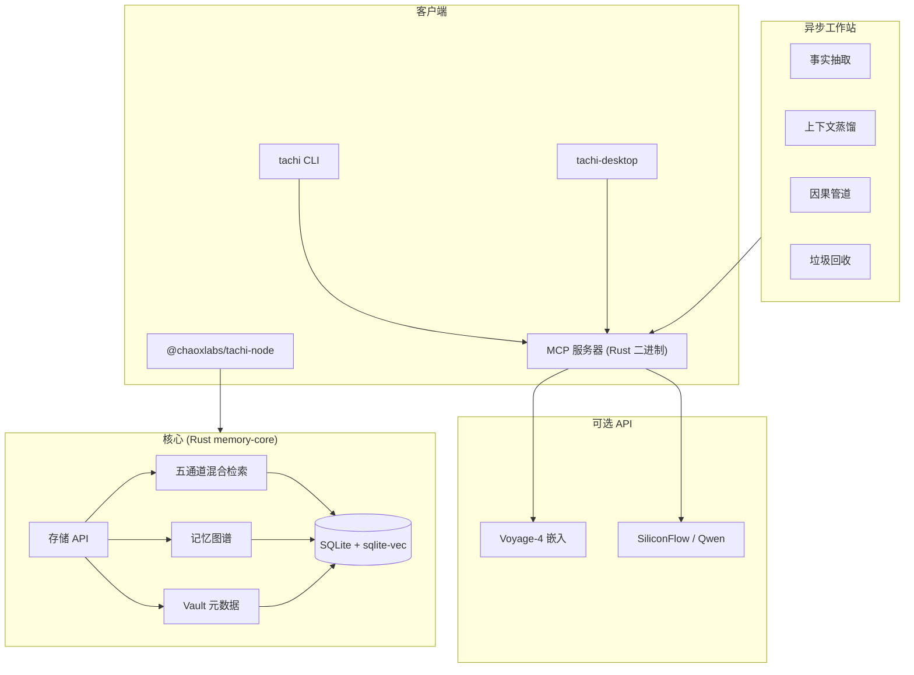

<div align="center">
  
  <h1>✧ 藏经阁（Tachi）</h1>
  <p><strong>面向自主 AI Agent 的本地优先记忆与工作流控制平面</strong></p>
  <p>
    <a href="README.md">English</a> ·
    <a href="README.zh-CN.md"><b>简体中文</b></a> ·
    <a href="README.classical.md">文言文</a>
  </p>
  <p>
    <a href="https://www.gnu.org/licenses/agpl-3.0"></a>
    
    
    
    
  </p>
</div>

---

## 一句话介绍

Tachi 是一个单二进制、本地优先的 Agent 记忆与协调后端。它以 [MCP](https://modelcontextprotocol.io/) 服务器形态（`memory-server`）运行，为 Agent 提供：

- **持久记忆**，支持混合语义 + 词法 + 图谱检索
- **层级命名空间**（`/user/preferences`、`/project/architecture`）
- **因果图谱边**，连接记忆、实体与决策
- **按域隔离的存储**，支持独立 GC 与保留策略
- **本地加密保险库**，用于 API 密钥与机密
- **Agent 协调**：交接令牌、看板、发布订阅（幽灵低语）
- **技能包与能力中心**：一次注册，各 Agent 共用
- **工作流控制平面**：`tachi_dispatch`、`tachi_arena`、`tachi_verify`、`tachi_agent_eval`

所有状态都存储在嵌入式 SQLite 中。**无需任何外部数据库。**

名字取自《攻壳机动队》中的塔奇克马：通过共享记忆不断进化的 AI 单元。

---

## 为什么用 Tachi

如今的 Agent 记忆通常是这样的：每次会话冷启动，重要上下文被塞进扁平向量库，几周后提示窗口里塞满无关碎片，而关键决策背后的"为什么"早已消失。

Tachi 基于四个信念构建：

1. **记忆应该结构化，而不是乱堆。** 层级 `path` 命名空间、因果图谱边和域隔离让长期上下文保持有序、可追踪。
2. **检索应该是混合且快速的。** 语义（sqlite-vec + Voyage）、词法（FTS5 + CJK）、时间衰减（ACT-R）和图谱激活蔓延通过 RRF 融合。我们针对本地低延迟查找优化；可复现的基准测试已在路线图中。
3. **Agent 应该共享基础设施，而不是各自 spawn 混乱。** Tachi Hub 一次注册 MCP 服务器和技能，已连接 Agent 共享连接池、空闲清理、熔断器和清洗后的环境。告别僵尸进程。
4. **长期状态应留在本地。** 所有数据库都是 SQLite 文件，无需云数据库。云同步应传输加密 bundle 和事件日志，而不是活的 WAL 文件。

## Tachi 与同类方案对比

Tachi 不是通用向量数据库，也不是托管记忆云服务。它是面向 MCP 智能体的本地优先协调后端。

| 维度 | Tachi | Mem0 | Letta | Chroma | 裸向量库 |
|---|---|---|---|---|---|
| **接入协议** | MCP server（STDIO / Streamable HTTP） | 多语言 SDK | Python SDK + ADE | HTTP API + SDK | 无 |
| **部署形态** | 单 Rust 二进制 | 库 + 可选服务 | 服务 + 前端 | 服务 + 可选 Cloud | 依赖实现 |
| **存储后端** | 本地 SQLite + sqlite-vec | 通常需 PG / Redis / 向量库 | PG + Qdrant / Chroma | Chroma 索引 | 多种 |
| **外部依赖** | 零（embedding provider 可选） | 中等 | 中等 | 低到中 | 高 |
| **默认数据位置** | 本地优先 | 云优先，可自托管 | 自托管 | 自托管 / Cloud | 依赖实现 |
| **记忆组织** | `path` 层级 + 因果图谱 + 域 | Entity + session | Agent 状态 + memory block | Collection + metadata | 无 |
| **工作流控制** | `dispatch` / `arena` / `verify` / `eval` | 无 | Agent 编排 | 无 | 无 |
| **目标用户** | 个人/小团队运行自主 Agent | 应用开发者集成记忆 | 构建有状态 Agent | 需要向量检索的系统 | 基础设施工程师 |

---

## 快速开始

### 1. 安装

```bash
brew tap kckylechen1/tachi && brew install tachi
```

或使用 shell 安装脚本（检测到 OpenClaw 时会自动安装插件）：

```bash
bash -c "$(curl -fsSL https://raw.githubusercontent.com/kckylechen1/tachi/v1.5.3/scripts/install.sh)"
```

验证：

```bash
tachi --version
```

### 2. 配置你的 Agent

将 Tachi 添加到 Agent 的 MCP 配置中。Profile 决定 Agent 能看到多少工具：

```json
{
  "mcpServers": {
    "tachi": {
      "command": "tachi",
      "env": {
        "VOYAGE_API_KEY": "<your-key>",
        "SILICONFLOW_API_KEY": "<your-key>",
        "TACHI_PROFILE": "standard"
      }
    }
  }
}
```

- `VOYAGE_API_KEY` —— 向量嵌入，必填。
- `SILICONFLOW_API_KEY` —— 结构化抽取、摘要、熔炉蒸馏，建议填写。
- `TACHI_PROFILE` —— 参见下方的 [工具暴露面 Profile](#工具暴露面-profile)。

服务器启动时还会自动加载项目根目录的 `.env`。将 `.env.example` 复制为 `.env` 以进行项目级配置。

### 3. 使用

以下示例展示传给 MCP 工具的 JSON 参数。门面工具暴露的字段与其底层原生工具一致；完整 schema 见 `crates/memory-server/src/tool_params/facade.rs`。

```json
// tachi_save —— 结构化记忆
{
  "tool": "tachi_save",
  "arguments": {
    "text": "前端必须使用 Vite，严禁 Webpack。允许 Tailwind。",
    "path": "/project/frontend",
    "importance": 0.8,
    "keywords": ["vite", "webpack", "tailwind"],
    "retention_policy": "durable"
  }
}

// tachi_search —— 混合检索
{
  "tool": "tachi_search",
  "arguments": {
    "query": "前端构建策略是什么？",
    "path_prefix": "/project",
    "top_k": 6,
    "scope": "memory"
  }
}

// set_state —— 确定性 KV（无嵌入）
{
  "tool": "set_state",
  "arguments": {
    "namespace": "trading",
    "key": "watchlist",
    "value": ["600089", "688256"]
  }
}
```

各宿主对应的配置文件路径和高级设置见 [`docs/INSTALL.md`](docs/INSTALL.md)。

---

## 系统架构


```mermaid
graph TD
    subgraph Clients["客户端"]
        CLI["tachi CLI"]
        RMCP["MCP 服务器 (Rust 二进制)"]
        Desktop["tachi-desktop"]
        Node["@chaoxlabs/tachi-node"]
    end

    subgraph Cloud["可选 API"]
        VOYAGE["Voyage-4 嵌入"]
        SILICON["SiliconFlow / Qwen"]
    end

    subgraph Workers["异步工作站"]
        EXTRACT["事实抽取"]
        DISTILL["上下文蒸馏"]
        CAUSAL["因果管道"]
        GC["垃圾回收"]
    end

    subgraph Core["核心 (Rust memory-core)"]
        API["存储 API"]
        SEARCH["五通道混合检索"]
        GRAPH["记忆图谱"]
        VAULT["Vault 元数据"]
        API --> SEARCH
        API --> GRAPH
        API --> VAULT
        SEARCH --> DB
        GRAPH --> DB
        VAULT --> DB
    end

    DB[(SQLite + sqlite-vec)]

    RMCP --> VOYAGE
    RMCP --> SILICON
    CLI --> RMCP
    Desktop --> RMCP
    Node --> Core
    Workers --> RMCP
```

---

## 项目结构

| 路径 | 说明 |
|------|------|
| `crates/memory-core` | Rust 核心：SQLite 存储、迁移、混合检索、图谱、域、Vault 元数据、sqlite-vec。 |
| `crates/memory-server` | MCP/CLI 二进制、Profile 过滤、Hub 路由、派发/工作流工具、Wiki、Vault 加密、守护锁、Foundry 后台任务。 |
| `crates/memory-node` | Node.js 原生绑定（`@chaoxlabs/tachi-node`）。 |
| `packages/tachi-cli` | TypeScript CLI 与 npm 封装。 |
| `apps/tachi-desktop` | Vite/React 桌面应用。 |
| `tools/cleaner` | `tachi-clean` 清理工具，用于安全的 target / worktree / temp 清理。 |
| `skill/` | 内置技能包：`amp`、`codex`、`superpowers`、`waza`。 |
| `integrations/openclaw` | OpenClaw 插件。 |
| `docs/` | Agent 生态规范、安装指南与工程文档。 |
| `bin/` | 本地编译的发布二进制。 |

---

## 核心能力

### 1. 层级化记忆
记忆以 `path` 命名空间存储（例如 `/user/preferences`、`/project/architecture`、`/handoff/active`），而非平铺索引。项目、用户和协调上下文因此自然隔离且可组合。

### 2. 五通道混合检索
- **语义** —— `sqlite-vec` KNN + Voyage-4 嵌入。
- **词法** —— 针对 CJK 优化的 FTS5（`libsimple`），支持查询扩展（同义词、缩写、短语变体）以提升稀疏语料召回。
- **时间衰减** —— 受 ACT-R 遗忘曲线启发。
- **图谱激活蔓延** —— 沿因果/实体边从种子权重传播；同跳内 noisy-OR 累积，防止密集节点垄断结果。
- **RRF 融合** —— 互惠排名融合汇总各通道，向量余弦再加权，减少高语义查询的排名倒置。

### 3. 因果图谱
`add_edge` / `get_edges` 创建并遍历因果、时序和实体关系。`save_memory` 可自动为共享实体的记忆建立链接（`auto_link`）。

### 4. 域感知路由
`register_domain` 创建独立作用域，每域可配置独立 GC 阈值（`gc_threshold_days`）、默认保留策略和路径前缀。`save_memory` 和 `search_memory` 可按域过滤。

### 5. 加密保险库（Vault）
本地优先的密钥存储：Argon2id KDF + AES-256-GCM、每秘独立 nonce、空闲自动上锁、暴力破解保护、按 Secret 的 Agent ACL、多钥轮换。项目内 Agent 可通过 `.tachi/vault.env` 别名解析 Vault 密钥。详见 [`docs/INSTALL.md`](docs/INSTALL.md)。

### 6. Tachi Hub 与技能包
一次注册 MCP 服务器、技能和工作流，所有已连接 Agent 都能发现并调用。`pack_register` / `pack_project` 安装 curated 技能集合并投射到 Claude、Cursor、Codex、Gemini、OpenCode 等格式。`run_skill` 将技能作为原生 MCP 工具执行。

### 7. 跨 Agent 协调
- **幽灵低语** —— Agent 间持久化主题发布/订阅（`ghost_publish`、`ghost_subscribe`、`ghost_ack`、`ghost_reflect`、`ghost_promote`）。
- **看板** —— 跨 Agent 卡片，支持 `ack` / `progress` / `result` 状态（`post_card`、`check_inbox`、`update_card`）。
- **交接令牌** —— Agent 会话之间结构化上下文传递（`handoff_leave`、`handoff_check`）。

### 8. 工作流控制平面
Tachi 不只是记忆库；它正在演变为 Agent 工程的持久控制平面：

- **`tachi_dispatch`** —— 按权限 profile 派发有界工作 Agent，并要求提交证据。
- **`tachi_arena`** —— 可审计的工作/顾问任务账本，记录运行状态。
- **`tachi_verify`** —— 记录后台验证证据（测试、类型检查、safe-merge gate）到 `.tachi/runs/<flow_id>/verification.json`。
- **`tachi_agent_eval`** —— 实时性能矩阵与 scorecard，反哺未来路由决策。
- **`tachi_complete`** —— 记录任务结果，支持 `subagents`、`tests_run`、`evidence_refs`、latency、token、cost 字段。

### 9. 神经熔炉与 Wiki
- **Foundry** —— 服务端上下文生命周期：`recall_context`、`capture_session`、`compact_context`、`section_build`、`compact_rollup`、`compact_session_memory`，以及 Agent 进化提案。
- **Wiki** —— Agent 维护的持久知识页：`tachi_wiki_write`、`tachi_wiki_search`、`wiki_browse`、`wiki_lint`。

---

## 工具暴露面 Profile

Tachi 根据 `TACHI_PROFILE` 暴露经过过滤的 MCP 工具面。`admin` 目录很大；大多数 Agent 应使用更小的 Profile。

| Profile | 暴露内容 | 适用场景 |
|---------|----------|----------|
| `standard` | 精选 12 工具门面：`tachi_search`、`tachi_save`、`tachi_memory`、`tachi_task`、`tachi_arena`、`tachi_verify`、`tachi_agent_eval`、`tachi_web_search`、`tachi_wiki`、`tachi_skill`、`tachi_gh`、`vault_status`，以及 `runtime_info` 和 `tachi_tools`。 | IDE Agent：Claude、Cursor、Codex、Windsurf、Trae、Antigravity。 |
| `coordinate` | `remember` + `coordinate` bundles：增加 `handoff_*`、`post_card`、`check_inbox`、`update_card`、`tachi_dispatch`、`approve_merge`、`tachi_handoff`、`tachi_workflow`、`tachi_orchestrator`。 | 主控/编排 Agent，负责派发任务并协调多 Agent。 |
| `operate` | `remember` + `operate` bundles：增加 Foundry 生命周期、`agent_register`、`hub_call`、`vault_unlock`/`lock`/`status`、`wiki_lint`。 | 运行时适配器、OpenClaw、运维自动化。 |
| `delegate` | 精选 7 工具门面：`tachi_tools`、`runtime_info`、`tachi_memory`、`tachi_web_search`、`tachi_browse`、`tachi_unstick`、`tachi_complete`、`run_skill`。 | `tachi_dispatch` 派生的工作 Agent。无派发、无交接。 |
| `admin` | 完整目录。 | 维护、开发与治理。 |

宿主别名自动解析：`claude`、`claude-code`、`codex`、`cursor`、`trae`、`windsurf`、`ide`、`antigravity` → `standard`；`worker`、`subagent`、`delegate` → `delegate`；`openclaw`、`hermes`、`runtime`、`adapter`、`ops` → `operate`。

未设置 Profile 时，Tachi 自 v1.0.1 起默认使用 `standard`。

---

## 模型栈

Phase 2 已简化 Lane 模型。后台 skill 和 foundry 调用现在**优先走 Claude CLI pool**，出错时回退到 raw API lane。大多数部署只需：

| 用途 | 是否必填 | 默认值 |
|------|----------|--------|
| 嵌入 | **是** | Voyage-4，通过 `VOYAGE_API_KEY` |
| 抽取 / 摘要 / 蒸馏 | 建议 | SiliconFlow `Qwen/Qwen3.5-27B`，通过 `SILICONFLOW_API_KEY` |

高级场景仍支持按 Lane 覆盖（`EXTRACT_*`、`DISTILL_*`、`SUMMARY_*`、`REASONING_*`），详见 `.env.example`。

---

## 环境变量配置

将 `.env.example` 复制为项目根目录的 `.env`：

```bash
# 必填
VOYAGE_API_KEY=your_voyage_key_here

# 建议
SILICONFLOW_API_KEY=your_siliconflow_key_here
SILICONFLOW_BASE_URL=https://api.siliconflow.cn/v1/chat/completions
SILICONFLOW_MODEL=Qwen/Qwen3.5-27B

# 可选：覆盖全局 DB 路径。默认 ~/.tachi/global/memory.db；
# 项目库在 <git-root>/.tachi/memory.db 自动检测。
MEMORY_DB_PATH=~/.tachi/global/memory.db
```

服务器启动时会自动加载项目根目录的 `.env`。

---

## 数据库安全

Tachi 使用 WAL 模式的 SQLite。违反以下规则可能导致数据库损坏：

| 规则 | 原因 |
|------|------|
| **每个库单一实例** | 服务器持有排他文件锁（`memory.db.lock`）。同一数据库文件同一时间只应有一个 Tachi 进程写入。 |
| **不要放在云同步目录** | iCloud、Dropbox、OneDrive、Google Drive 与 SQLite WAL 不兼容。数据库请放在 `~/.tachi/` 或本地项目路径。 |
| **不要并发裸写** | 服务器运行时不要用 `sqlite3` 直接 INSERT/UPDATE。只读查询是安全的。 |
| **优雅关闭** | 服务器处理 SIGINT/SIGTERM，退出时执行 `PRAGMA optimize`。避免 `kill -9`。 |

活的 SQLite 文件应留在本地。应同步加密 bundle、append-only 事件日志、Vault 密文、工作流摘要、wiki/skill 产物等。

---

## 本地开发

```bash
# 编译发布二进制
cargo build --release

# 运行全部测试
cargo test --all

# 从源码运行 MCP 服务器，使用 standard profile
cargo run -p memory-server -- --profile standard
```

需要 Rust ≥ 1.75。Node 绑定和迭代开发建议安装 `maturin` 和 `cargo-watch`。

---

## 性能基准

可复现的基准测试套件正在整理中。当前设计目标包括：

- **本地优先延迟**：在热 SQLite 上优化至亚 10 ms 查找。
- **混合检索**：融合语义、词法、时间、图谱多种信号。
- **分层上下文**：通过 `L0 → L1 → L2` 压缩减少提示冗余。
- **零外部数据库依赖**：单个 Rust 二进制，每个库一个 SQLite 文件。

---

## 致谢

Tachi 的设计受到以下 Agent 长期记忆领域工作的启发：

- **[LongMem](https://github.com/Victorwz/LongMem)** (NeurIPS 2023) —— 解耦记忆架构；影响双库隔离与缓存长上下文设计。
- **[gbrain](https://github.com/garrytan/gbrain)** —— brain-vs-memory 分层；影响命名空间设计、全局/项目隔离和后台 GC 管道。
- **[ENGRAM](https://arxiv.org/abs/2511.12960)** —— 类型化记忆分类 + 稠密检索；验证混合搜索方向。
- **[Karpathy's LLM Wiki](https://gist.github.com/karpathy/442a6bf555914893e9891c11519de94f)** —— LLM 维护结构化 wiki 页面；直接启发 Tachi Wiki 系统。

---

## 开源协议

[AGPLv3](LICENSE) © 2026 Tachi Authors。
